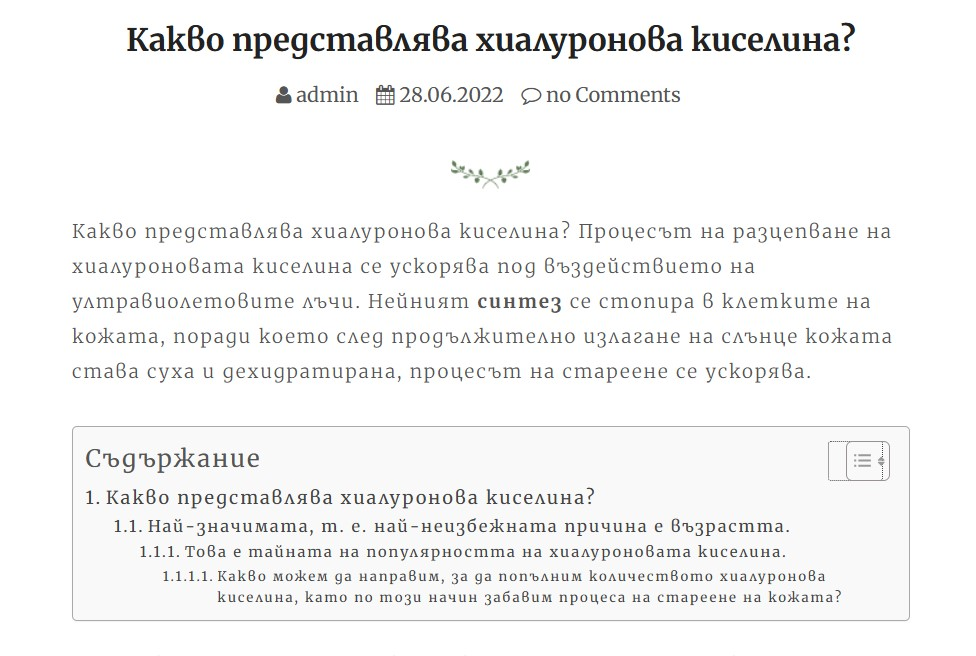
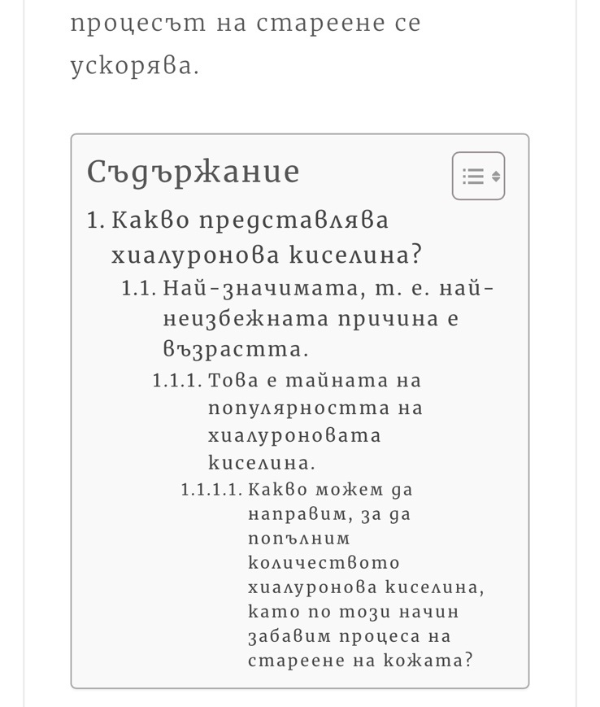

<h2>WP-TOC</h2>

Modern, lightweight Table of Contents for WordPress. Auto-generates a TOC from headings, supports shortcode and widget, and is translation-ready.

Quick links: [Website](https://stanchev.bg/) · [Issues](https://github.com/stantchev/WP-TOC/issues) · [Changelog](./changelog.txt)

### Highlights
- Auto-generate TOC from H1–H6
- Auto-insert per post type or via shortcode/widget
- Smooth scroll and hierarchy, counters inside/outside
- Sticky TOC widget with toggle
- Works with Classic/Gutenberg/Elementor/Divi/WPBakery
- Fully translatable; admin UI language can be forced in settings

### Installation
1) Upload to `wp-content/plugins/wp-toc/` or install via WP Admin → Plugins.  
2) Activate.  
3) Go to Settings → Table of Contents to configure.

### Usage
- Auto insert: Settings → Table of Contents → General → Auto Insert.  
- Shortcode in content: `[ez-toc]`  
- Sticky widget: Appearance → Widgets → TOC Sticky

Shortcode options:
- `header_label="Title"`  
- `display_header_label="no"`  
- `toggle_view="no"`  
- `initial_view="hide|show"`  
- `display_counter="no"`  
- `heading_levels="2,3"`  
- `class="custom_toc"`

### Localization
- Text domain: `easy-table-of-contents`  
- Place `.mo/.po` in `languages/`  
- Force admin UI language: Settings → Table of Contents → General → Plugin UI Language

### Pictures
#### Desktop

#### Mobile

### Support
Use the Technical Support tab in the plugin settings. Messages go to `seo@stanchev.bg`.

### License
GPLv3. See [LICENSE]([https://www.gnu.org/licenses/gpl-2.0.html](https://github.com/stantchev/WP-TOC#GPL-3.0-1-ov-file)).

### Contributing
PRs welcome. Please open issues with clear repro steps.
